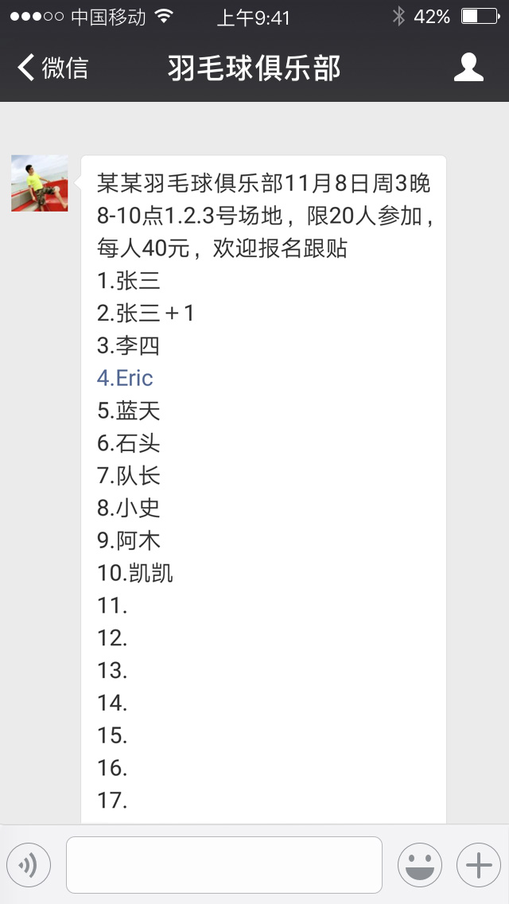

### IOS微信消息换行


---

  [(本人羽毛球狂热份子,时常在微信群内报名遇到此问题)]()

  在使用微信聊天的时候经常会遇到:
  * 当IOS用户发出的微信消息显示是有换行的
  * 可是Android用户看到的是空格而不是换行
  * 为了满足用户体验一致，Android用户也许需要一个一个换行重新编辑消息
  * 为了方便各位完美主义Android用户特此开发此小工具
  * 如果微信Android版能更新解决那就更完美了


##### 下载链接：

[点击下载APK文件](https://github.com/zabio/WxWrap/blob/master/sample.apk?raw=true)


##### IOS用户界面：



##### Android用户看到的界面：


##### 使用示例 :


----

### 实现思路 :

1. 将IOS的文本转为Unicode后发现 IOS的换行符为 /ud
2. 将Android文本转换后发现换行符号为 /ua
3. 批量将/ud --> /ua
4. 最后再将Unicode转成普通的文本

##### Demo片段:

```java
        fun translate(view: View) {

            val str = et.text.toString()
            Log.e(sTAG, str)

            val unicode = UnicodeUtil.string2Unicode(str)
            Log.e(sTAG, "unicode:\n" + unicode)

            val newUnicode = unicode.replace("\\ud", "\\ua")
            Log.e(sTAG, "newUnicode:\n" + newUnicode)

            val newStr = UnicodeUtil.unicode2String(newUnicode)
            Log.e(sTAG, "newStr:\n" + newStr)

            et.setText(newStr)

        }

```

##### 下载链接：

[点击下载APK文件](https://github.com/zabio/WxWrap/blob/master/sample.apk?raw=true)

[@copyright]() 转发请注明出处
